# Облачное хранилище
## Описание задания: [ссылка](https://github.com/netology-code/jd-homeworks/blob/master/diploma/cloudservice.md)
## Описание решения
Backend сервис для хранения файлов, взаимодействует с [frontend](https://github.com/netology-code/jd-homeworks/tree/master/diploma/netology-diplom-frontend)
по принципам REST. Особенностью проекта является
применение JWT аутентификации, реализация которой выполнена внутри самого сервиса. Используемые технологии Spring Boot 3.x,
Java 17, Docker, Liquebase, PostgreSQL, JUnit, Mockito, Testcontainers.
## Перед началом работы
1) Заранее определен администратор с глобальными правами: логин=admin, пароль=admin. Механизма для регистрации новых пользователей не предусмотрено, поэтому для работы использовать его.
2) Каждый запрос клиента серверу должен содержать заголовок auth-token, в котором находится токен, получаемый при успешной аутентификации.
3) Разрешенный размер файла для хранения < 10 Mb.
4) Имя загружаемого файла должно содержать одну точку, т.е. имя.расширение
5) (*) Запрещено вставлять файлы с одинаковыми именами
## Запуск
Перейти в корень, собрать проект:
```
mvn clean package --Dskiptests
```
В корневой папке выполнить команду:
```
docker compose up
```
## Примеры запуска
Вход в систему от имени администратора

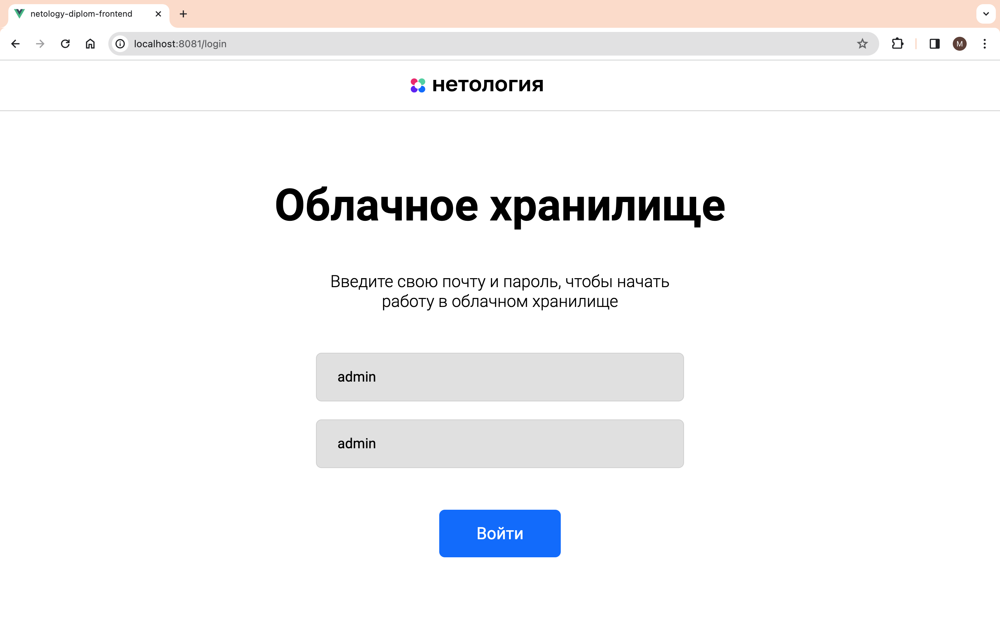

Интерфейс пользователя

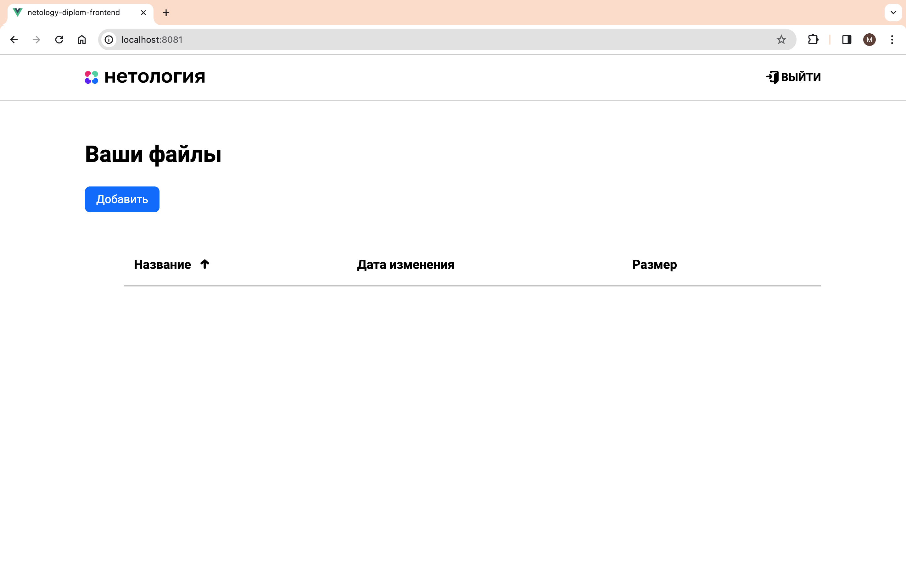

Загрузка файлов в хранилище

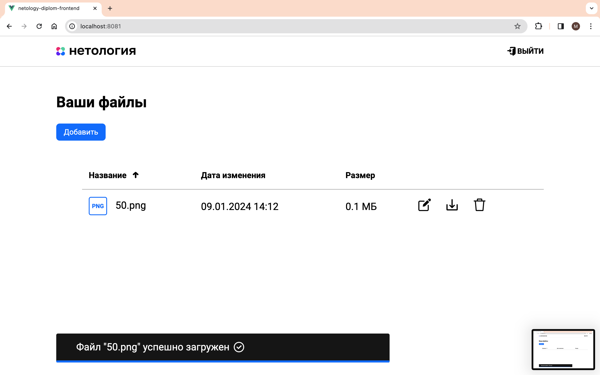

Переименование файла в хранилище

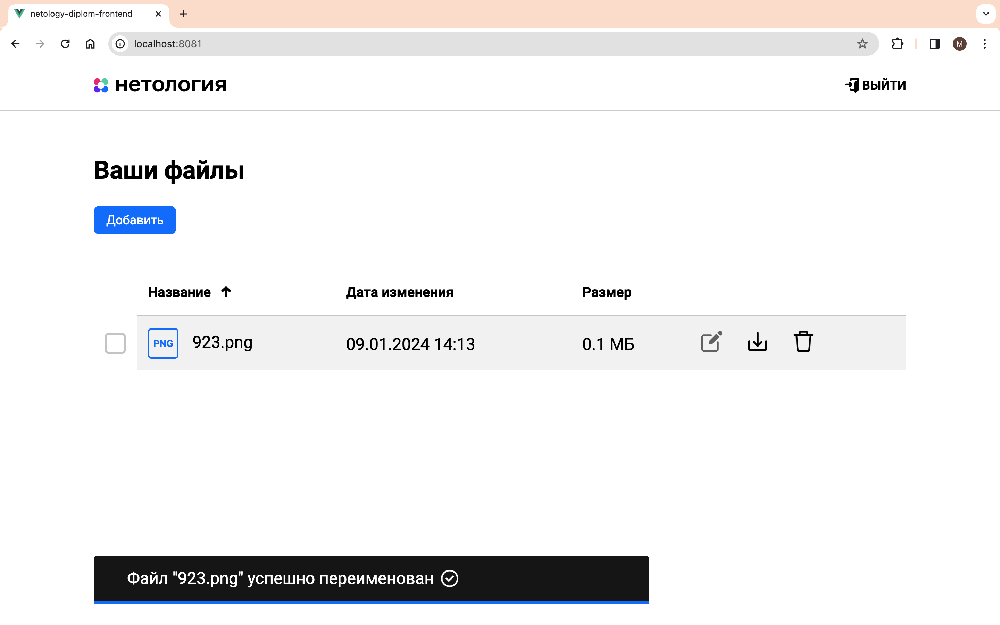

Выгрузка файлов 

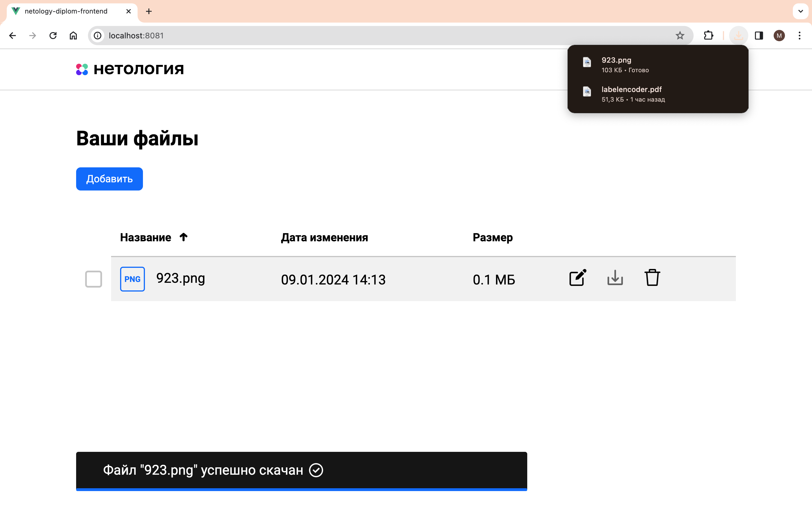

Удаление файла

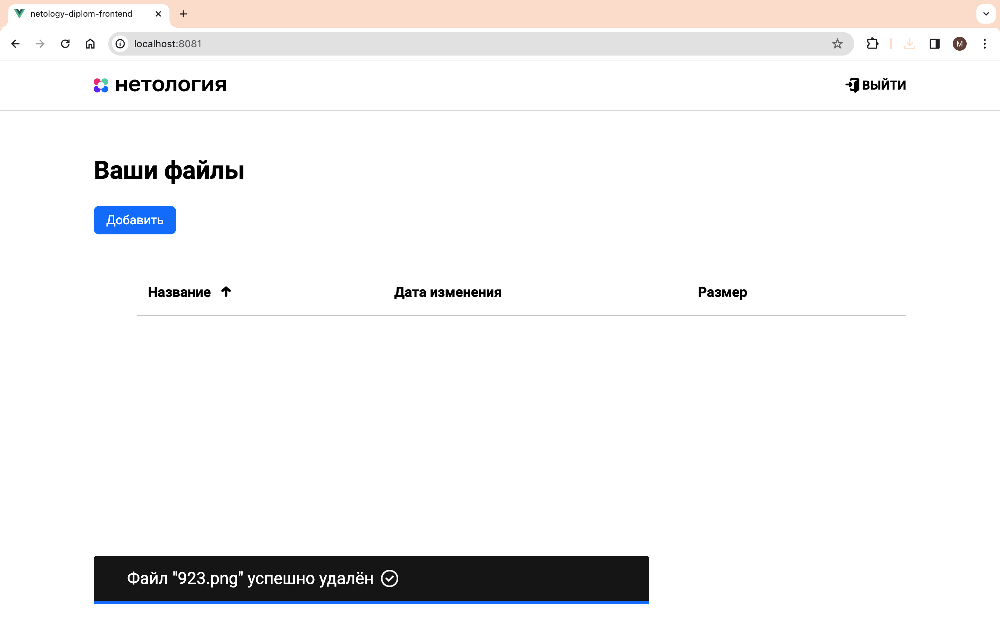

Работа с несколькими файлами

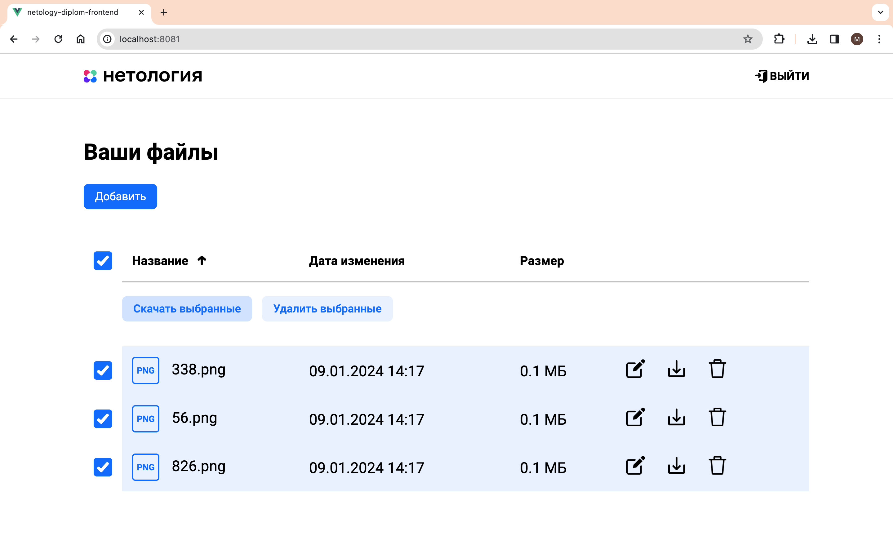

# Примеры запуска без клиента
Успешный вход от имени администратора

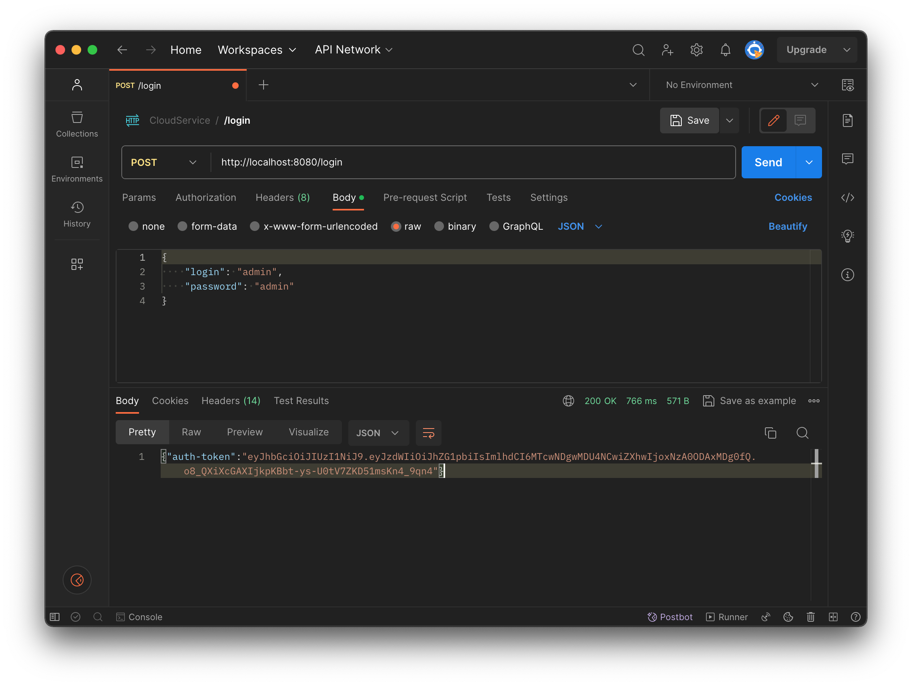

Получение отрицательного числа файлов из хранилища

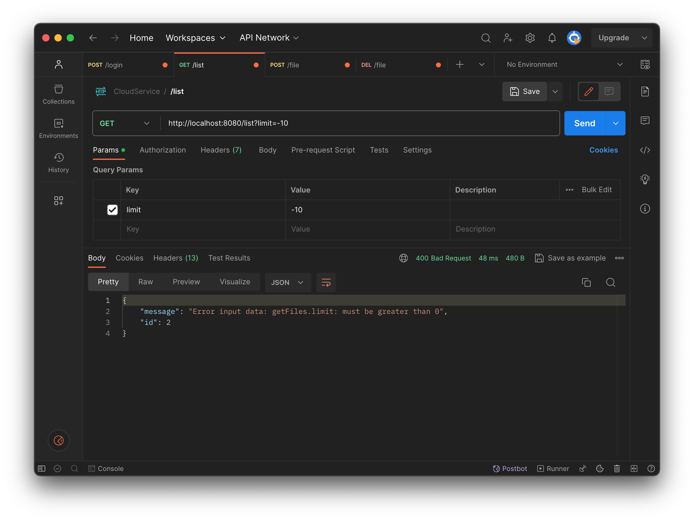

Загрузка файла с истекшим токеном аутентификации

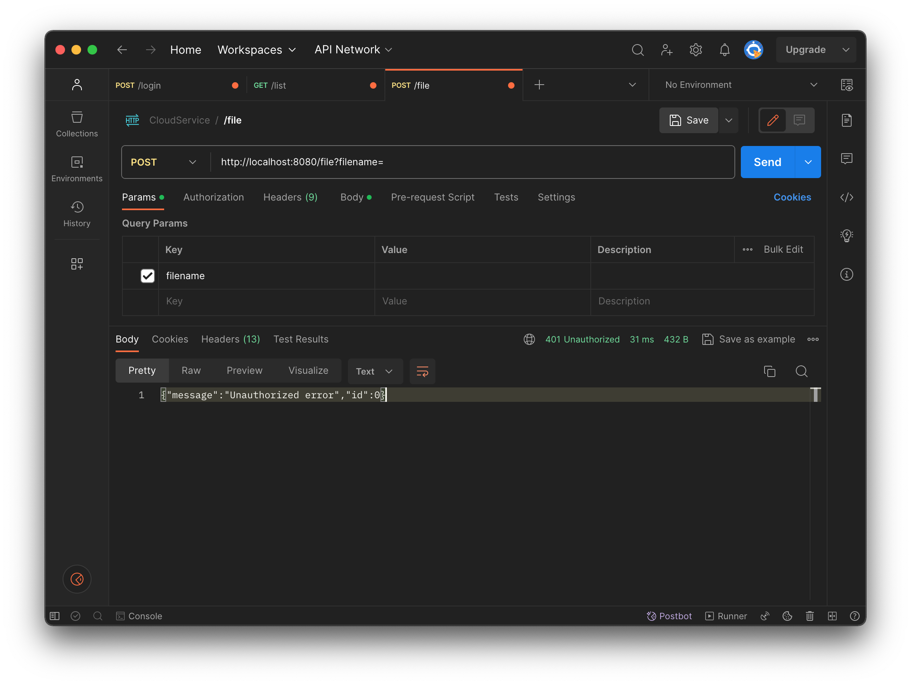

Удаление несуществующего файла

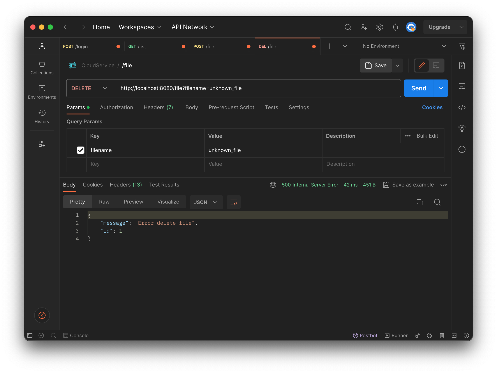